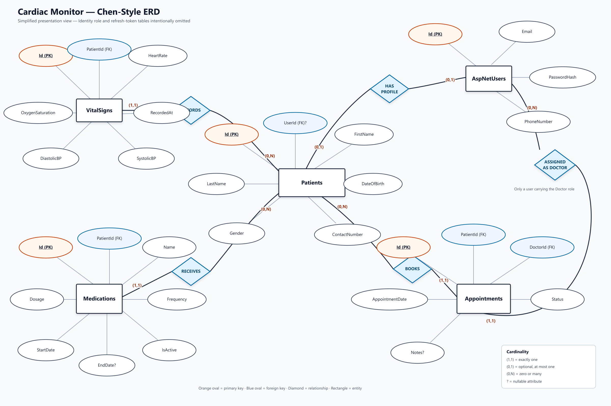

# Cardiac Monitor ERD

## Relationship summary

- `AspNetUsers` → `Patients`: optional one-to-one relationship. `Patients.UserId` is nullable and unique. Deleting the linked user cascades to the patient.
- `AspNetUsers` → `Appointments`: one doctor can be assigned to many appointments. Doctor deletion is restricted while appointments reference that doctor.
- `Patients` → `VitalSigns`: one-to-many relationship with cascade delete.
- `Patients` → `Medications`: one-to-many relationship with cascade delete.
- `Patients` → `Appointments`: one-to-many relationship with cascade delete.

`AspNetUsers` represents every authenticated identity. A user assigned to the `Doctor` role acts as a doctor when referenced by `Appointments.DoctorId`; a separate doctor table is not required by the current model.

The presentation diagram intentionally omits `AspNetRoles`, `AspNetUserRoles`, `RefreshTokens`, and standard Identity support tables. Those tables still exist in the physical database but are not needed to explain the core medical domain.

The Week 6 migration adds optimized composite indexes for vital-sign history, medication lookup, and appointment scheduling. It also prevents two appointments from assigning the same doctor at the exact same time.

## Editable source

The Mermaid source is available in [`CardiacMonitor-ERD.mmd`](CardiacMonitor-ERD.mmd). It can be opened in Mermaid Live Editor, VS Code with a Mermaid extension, or any Mermaid-compatible documentation system.
