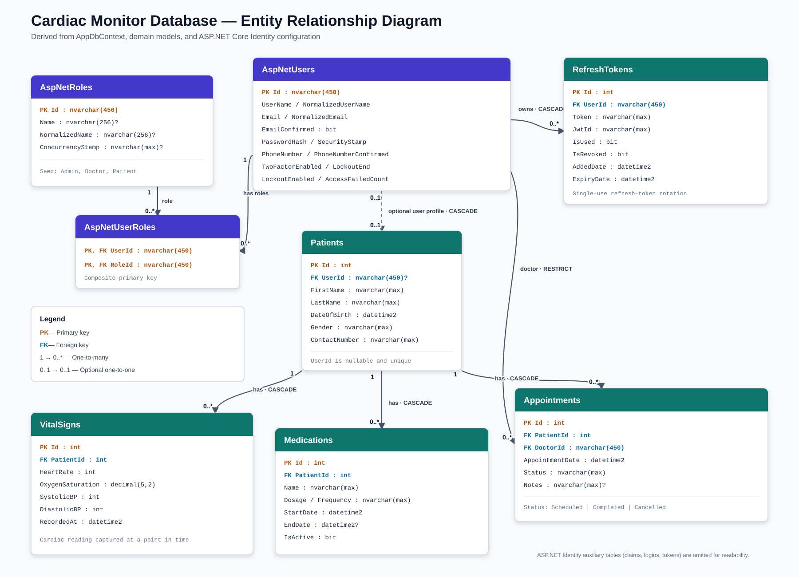

# Cardiac Monitor ERD

## Relationship summary

- `AspNetUsers` → `Patients`: optional one-to-one relationship. `Patients.UserId` is nullable and unique. Deleting the linked user cascades to the patient.
- `AspNetUsers` → `RefreshTokens`: one-to-many relationship with cascade delete.
- `AspNetUsers` → `Appointments`: one doctor can be assigned to many appointments. Doctor deletion is restricted while appointments reference that doctor.
- `AspNetUsers` ↔ `AspNetRoles`: many-to-many relationship through `AspNetUserRoles`.
- `Patients` → `VitalSigns`: one-to-many relationship with cascade delete.
- `Patients` → `Medications`: one-to-many relationship with cascade delete.
- `Patients` → `Appointments`: one-to-many relationship with cascade delete.

The diagram focuses on the domain tables and the Identity tables directly involved in domain relationships. Standard Identity support tables such as `AspNetUserClaims`, `AspNetRoleClaims`, `AspNetUserLogins`, and `AspNetUserTokens` are generated by `IdentityDbContext` but omitted from the image to keep the diagram readable.

## Editable source

The Mermaid source is available in [`CardiacMonitor-ERD.mmd`](CardiacMonitor-ERD.mmd). It can be opened in Mermaid Live Editor, VS Code with a Mermaid extension, or any Mermaid-compatible documentation system.
