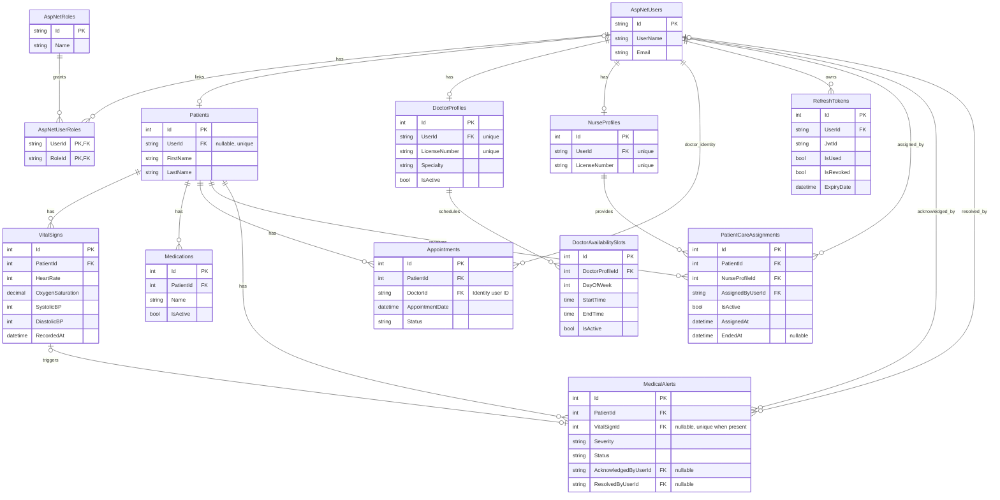

# Cardiac Monitor ERD

## Current schema — Sprint 4 close-out

The current diagram includes the clinical domain, professional profiles, care assignments, Doctor availability, medical alerts, refresh tokens, and Identity role membership. Selected fields are shown for readability; EF Core configurations and migrations define the complete physical schema.



## Relationship summary

| Relationship | Cardinality and deletion behavior |
| --- | --- |
| Identity user → Patient | Optional profile; nullable, unique Patient.UserId; Cascade |
| Identity user → DoctorProfile / NurseProfile | Each professional profile requires one user; unique UserId; Cascade |
| Patient → VitalSigns / Medications / Appointments | One-to-many; Cascade |
| Identity user → Appointments | DoctorId references AspNetUsers.Id, not DoctorProfiles.Id; Restrict |
| DoctorProfile → DoctorAvailabilitySlots | One-to-many; Cascade |
| Patient → PatientCareAssignments | One-to-many; Restrict |
| NurseProfile → PatientCareAssignments | One-to-many; Cascade |
| Identity user → PatientCareAssignments | AssignedByUserId records the assigning identity; Restrict |
| Patient → MedicalAlerts | One-to-many; Restrict |
| VitalSign → MedicalAlert | Optional one-to-one link; deleting the reading sets VitalSignId to null |
| Identity user → MedicalAlerts | Optional acknowledged/resolved audit-user links; Restrict |
| Identity user → RefreshTokens | One-to-many; Cascade |
| Identity users ↔ Identity roles | Standard AspNetUserRoles join table |

A Doctor has both an Identity user ID (string) and a professional profile ID (integer). Appointment booking uses the former; availability uses the latter. Authorization still depends on roles and Patient-resource checks, not merely on an FK relationship.

## Integrity and optimized lookups

- Unique Doctor/time appointment index prevents identical booking times for one Doctor.
- Patient/time vital-sign and appointment indexes support history and scheduling queries.
- Patient/active medication index supports medication lookup.
- Professional UserId and LicenseNumber indexes are unique.
- Patient/Nurse assignment pairs are unique; an assignment check constraint links IsActive with EndedAt.
- Availability slots have unique schedule tuples and valid day/time check constraints.
- MedicalAlert.VitalSignId is unique when present; status/severity checks and lookup indexes support the alert workflow.
- Refresh tokens have a unique token index and an expiry lookup index.

## Migration management

The six existing migrations in [Data/Migrations](../Data/Migrations/) manage schema evolution. The latest is `20260903203751_Week7CareTeamSchedulingAndAlerts`. Apply the existing history with:

```powershell
dotnet ef database update --project CardiacMonitor.csproj
```

This Day 5 update changes documentation only; it does not create a migration or modify a database.

## Editable source and earlier presentation assets

- [Current Mermaid source](CardiacMonitor-ERD-Current.mmd).
- [Earlier core-domain Mermaid source](CardiacMonitor-ERD.mmd).
- [Earlier Chen diagram](CardiacMonitor-ERD-Chen.png).

The earlier diagram remains a historical core-domain illustration, not the complete current schema. Standard Identity claims, logins, and token-support tables are omitted from the presentation diagram for clarity; they remain part of Identity's physical schema.
